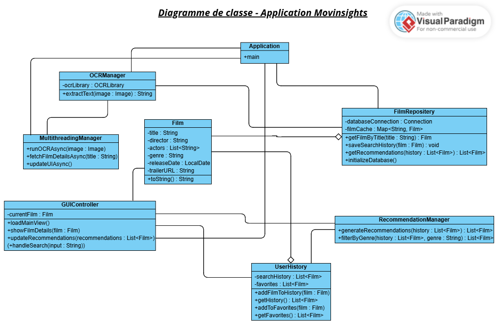

# Nom du Projet

Movinsights


      

## Auteurs

- Groupe D131
- g63797 Zineb

## Description du Projet

Ce projet est une application Java permettant de scanner des affiches de cinéma avec la librairie OCR Tesseract pour en extraire des informations (titre, acteurs, réalisateurs, genres). Elle propose des analyses avancées telles que les tendances du cinéma, l'indice de diversité et la popularité des acteurs/réalisateurs. L'application inclut une interface utilisateur intuitive, une gestion des données efficace et respecte les bonnes pratiques de programmation. 


## Diagramme de Classe

Le diagramme de classe ci-dessous illustre la structure du modèle de l'application. 



## Choix de l'Architecture

L'architecture retenue pour ce projet est _model-view-controller_. 

## Plan de Tests Fonctionnels

Les tests fonctionnels élémentaires pour le projet sont les suivants :

- Test de la reconnaissance de texte avec Tesseract : on télécharge une affiche de film et on vérifie que le résultat est bien le texte contenu dans l'affiche (le cas limiet serait de télécharger une image floue ou contenant des polices inhabituelles)

- Test de la recherche d'informations sur un film : on télécharge une affiche de film et on teste si l'application renvoie bien les données du film correspondant à partir du titre extrait (le cas limite serait de tester avec un titre inexistant)

- Test de l'enregistrement dans l'historique : après plusieurs recherches consécutives, on vérifie que ces derniers films se trouvent bien dans l'historique (le cas limite serait de rechercher un film déjà présent dans l'historique)

- Test des recommandations : en consultant l'historique par exemple, on vérifie que l'application propose bien des films similaires en se basant sur les recherches précédentes (le cas limite serait de consulter un historique vide)

- Test de l'interface utilisateur : on vérifie que la navigation dans les vues de l'application se passe bien et ne bloque pas

- Test des fonctionnalités multithread : on vérifie que lors d'exécution de tâche lourde, le mutlithreading se passe bien et l'application reste fluide sans blocage

- Test des cas d'erreur : on vérifie que pour chaque erreur, un message clair est retourné afin de donner plus de détails sur cette erreur (par exemple si l'image téléchargée ne contient pas de texte, si la base de donnée n'existe pas etc)

## Calendrier Hebdomadaire des Tâches

### Semaine 1 - 6H

| Qui       | Description  
|--         | --
|Zineb      | Analyse du projet, configuration de l'environnement de développement et validation du projet

### Semaine 2 - 6H

| Qui       | Description  
|--         | --
|Zineb      | Diagramme de classe et complétion du fichier readme

### Semaine 3 - 6H

| Qui       | Description  
|--         | --
|Zineb      | Implémentation de l'OCR et de la base de donnée

### Semaine 4 - 6H

| Qui       | Description  
|--         | --
|Zineb      | Implémentation et test des classes principales (Film et FilmRepositery)

### Semaine 5 - 6H

| Qui       | Description  
|--         | --
|Zineb      | Implémentation de la classe controller.Application et ajout de fonctionnalités de recherche + affichage

### Semaine 6 - 6H

| Qui       | Description  
|--         | --
|Zineb      | Implémentation des classes UserHistory et RecommendationManager + interface graphique JavaFX

### Semaine 7 - 6H

| Qui       | Description  
|--         | --
|Zineb      | Interface graphique + tests unitaires

### Semaine 8 - 6H

| Qui       | Description  
|--         | --
|Zineb      | Amélioration du README + derniers tests et livraison du projet


## Installation et utilisation

Pour utiliser l'application, suivez les étape suivantes : 

1. Clonez ce repository :
   ```bash
   git clone https://git.esi-bru.be/63797/4-prj-1-d-d-131-63797.git
   ```

2. Démarrez le projet en exécutant la commande 
   ```bash
   mvn exec:java
   ```


## Problèmes connus de l'application

Lors de la réalisation des tests fonctionnels, nous avons constatés les problèmes suivants : 

- ...

## Retrospective

Nous avons constaté les différences suivantes entre le diagramme de classes imaginés au départ et l'implémentation réalisée : 

- ...


